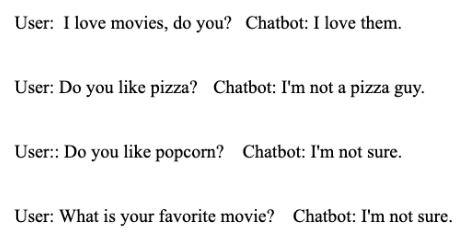
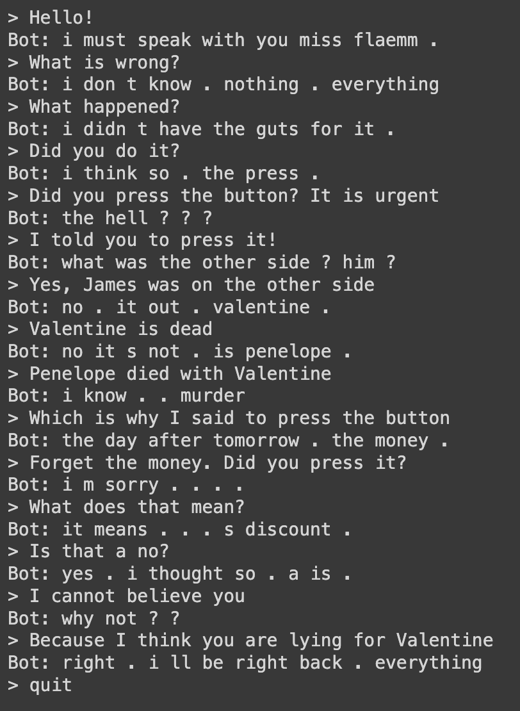

## AAI 520 - Natural Language Processing
### Chatbot Design
#### Group 4 - Hani Jandali, Kay Cheung, Suvo Ganguli

---

In this final project report for the Natural Language Processing course (AAI520), we present the design, development, and evaluation of a conversational chatbot. The chatbot was trained using the Cornell Movie Dialogues Corpus, a popular dataset that provides natural conversational exchanges in a wide range of settings. The goal of the project was to explore different modeling techniques for generating conversational agents, with a focus on both the performance and the quality of the interactions.

Two distinct models were developed and tested during the course of the project. The first model leveraged GPT-2, a state-of-the-art generative language model known for its impressive text-generation capabilities. However, despite its strong performance in many other natural language generation tasks, the GPT-2 based chatbot underperformed in terms of conversational quality. It often produced generic or neutral responses, resulting in interactions that lacked coherence and engagement—key elements for a conversational agent.

Here is an example conversation using the GPT2 chatbot.

The second model utilized a sequence-to-sequence (seq2seq) architecture, which is particularly well-suited for tasks like machine translation and dialogue generation. This model produced more conversationally appropriate responses, leading to a more dynamic and engaging interaction between the user and the chatbot The seq2seq model met the project’s expectations by delivering coherent, contextually relevant replies, albeit with some grammatical mistakes, making it the more successful of the two models.

The final implementation was deployed through a web interface designed using Flask, allowing users to interact with the chatbot in real-time. This interface provided an accessible and user-friendly platform for testing the effectiveness of the chatbot, showcasing the practical applications of natural language processing in conversational AI. The chatbot can be viewed at https://kay-q-mich.github.io/AAI520_FinalProject/. It requires the web server that serves a model to work. The web server needs an api endpoint `/get_response` with an input of the form `{ "user_input": "..." }` and a response of the form `{ "response": "..." }`. The following Google Colab can be used to run the flask app: https://colab.research.google.com/drive/1bDPf7SG5TJq249JnwutgAxrjxjhH8o_o.

### Relevant Code:
- Chatbot-GPT2.ipynb - chatbot for method 1
- Seq2Seq_Chatbot.ipynb - chatbot for method 2
- FlaskApp/app.py
- FlaskApp/model.py
